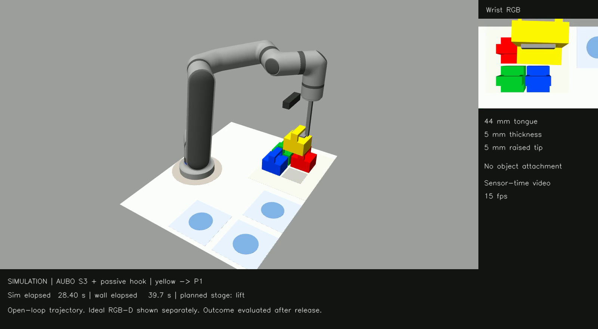

# 美团第四届低空经济与具身智能挑战赛 · 2026

参赛项目工作区，用于管理比赛资料、规则梳理，以及后续的机器人方案、实验记录和交付材料。

[**观看 / 下载单块钩取 Demo（约 57 秒）**](https://github.com/AfonsoZhang/meituan-robotics-challenge-2026/releases/download/demo-v1.0.0/demo.mp4) · [完整结果与下载包](https://github.com/AfonsoZhang/meituan-robotics-challenge-2026/releases/tag/demo-v1.0.0) · [仿真搭建说明](demo/SETUP.md)

[](https://github.com/AfonsoZhang/meituan-robotics-challenge-2026/releases/download/demo-v1.0.0/demo.mp4)

单块黄块 → P1：落点误差 **2.25 mm**，内框覆盖率 **84.4%**。这是开环仿真展示，腕部 RGB 独立显示；不代表实物承载、三块闭环或鲁棒安全控制已验证。

**新增视觉修正实验：** [观看 +6 mm 偏移修正视频](https://github.com/AfonsoZhang/meituan-robotics-challenge-2026/releases/download/vision-v1.1.0/corrected-6mm.mp4) · [对照视频和完整原始证据](https://github.com/AfonsoZhang/meituan-robotics-challenge-2026/releases/tag/vision-v1.1.0)。修正后落点误差 2.12 mm，对照组也成功；当前只验证单块抓取前定位修正，尚不能证明成功率提升。

当前状态：三份原始比赛 PDF 和两张用户提供的 JPG 已归档。两张 JPG 分别为电池 CAD 渲染图与工程尺寸图，并非实拍（BATTERY-RENDER、BATTERY-DRAWING）；图示设计尺寸及内框面积分析见 [电池几何与抓取分析](docs/battery-geometry.md)，图内未明示尺寸单位，当前暂按 mm 解释，实物尺寸仍待核验。

2026-09-06 用户确认机械臂为遨博 S3、相机为 RealSense D435i，采用传统视觉路线，计算计划使用本机；末端现有三种候选：方案一用钩子钩取电池提手（USER-EE-20260906-01），方案二用吸盘侧面吸附（USER-EE-20260906-02），方案三用卡环（USER-EE-20260906-04）。新增方案不替代已有方案，最终选型依据实物和台架对比结果；此前平行两指夹持仅为历史工程候选，当前不以采购夹爪为前提。相机仍计划安装在机械臂末端，采用眼在手上（eye-in-hand）方式，实际安装状态未核实（USER-HW-20260906-03）；支架建议固定在法兰转接件或工具的刚性固定座。三套末端的已有设备、结构与连接方式，以及吸盘所需的实物密封条件、真空系统和控制接口待核实；初步方案先按初赛固定工位展开，尚无实机验证结果。

## 项目入口

- [规则摘要与评分](docs/rules-summary.md)：按原始 PDF 页码追溯。
- [待确认事项](docs/open-questions.md)：设备、技术路线和规则歧义。
- [硬件与传统视觉方案](docs/hardware-vision-plan.md)：已确认配置、建议架构、标定与实施顺序。
- [电池几何与抓取分析](docs/battery-geometry.md)：CAD 与尺寸图读图、提手钩取几何与验证要点及内框面积计算。
- [末端三方案对比](docs/end-effector-options.md)：方案一提手钩取、方案二侧面吸附、方案三卡环，以及选型与验证依据。
- [仿真方案](docs/simulation-plan.md)：Gazebo + ROS 2 选栈依据、aubo_description 核实结果、S3 运动学、底图可达性实算与推进顺序。
- [Demo 录制评估](docs/demo-readiness.md)：与队友 demo 对比、44/5/5 舌规验证边界、PolyU RA 申请适配和录制前缺口（2026-09-07 整理）。
- [单块 Demo 实录](docs/demo-recording.md)：已录制黄块 → P1，约 57 秒；含视频、轨迹误差图、结果与可复现入口（2026-09-07）。
- [视觉修正实验](docs/vision-correction.md)：单块 RGB-D 抓取前定位修正及初始偏移对照。
- [资料说明](materials/README.md)：原件、提取文本及预览图的使用方式。
- [来源清单](materials/manifest.json)：原始路径、文档页数和 SHA-256。

## 目录

```text
meituan-robotics-challenge-2026/
├── AGENTS.md
├── README.md
├── docs/
│   ├── rules-summary.md
│   ├── hardware-vision-plan.md
│   ├── battery-geometry.md
│   ├── end-effector-options.md
│   ├── simulation-plan.md
│   └── open-questions.md
└── materials/
    ├── README.md
    ├── manifest.json
    ├── original/      # 三份原始 PDF、两张原始 JPG
    ├── extracted/     # FAQ、底图的逐页提取文本
    └── previews/      # 两张底图的屏幕预览
```

## 比赛范围

- 初赛：固定底座机械臂识别并抓取指定颜色电池，完成 T0 基础放置和 P1–P3 指定序列摆放。
- 初赛评分：基础任务 40 分、序列任务 50 分、时间效率 10 分。
- 决赛：机器人抓取单块目标电池，携带通过障碍区，放入指定电池仓。

以上来自所提供的规则 PDF 第 2–6 页及 FAQ 第 1–4 页；详细限制和补充见规则摘要。

内框判定更新：2026-09-06 用户转述组委会答复，确认电池主体落在内框内的垂直投影面积占其总投影面积至少 70%。项目按此执行内框判定，原 PDF 的不同表述和答复来源保留在规则摘要及 Q15（USER-RULE-20260906-02）。

2026-09-06 用户提出引入仿真，并指定 S3 模型来源为 `AuboRobot/aubo_description` 的 `urdf/` 目录（USER-SIM-20260906-01）。该仓库确有 `urdf/aubo_S3.urdf`（`aubo_S3_10`、`aubo_S3_T0` 是指向它的符号链接），但不含末端工具帧、`<gazebo>`/`<transmission>` 与 `config/`，许可证状态存在冲突（package.xml 写 BSD，仓库无 LICENSE 文件）。用该名义模型与底图矢量坐标实算：各目标位距底座参考圆圆心 287–527 mm，在工具轴竖直向下、法兰高度 150 mm 与 250 mm 两档均可解，**运动学可达性不是瓶颈**；该结论未含碰撞、工具长度与实机 DH 校准。同日用户选定仿真栈为 **Gazebo + ROS 2**，本轮覆盖可达性与碰撞、相机 RGB-D 合成图、三块序列端到端，接触物理先只做钩取，模型暂不归档（USER-SIM-20260906-02）。同日已完成环境搭建：ROS 2 Humble + Gazebo Classic 11.10.2 装好，工作空间 `~/aubo_ros2_ws`，自建 overlay 包 `meituan_sim` 补齐上游缺的 Gazebo 接线；`ros2 launch` 单条命令即可 spawn S3 并由 `joint_trajectory_controller` 驱动六轴（误差 < 1e-4 rad），且零位 TF 与本项目独立 FK 结果一致、可达性求解在仿真中复核通过（ENV-SIM-20260906）。场景资产已建：底图（贴图由归档 PDF 渲染）与 4 块道具电池按底图矢量坐标生成，p1/p2 两个任务页可切换；p2 的 4 个电池位与 P1–P3 共 7 个目标位在工具竖直向下、法兰高 250 mm 约束下实测可达，xy 误差 ≤0.71 mm 且电池零位移。D435i 已按眼在手上建模并出 RGB-D：视场与官方规格一致，深度中心读数与 TF 真值差恰好 50 mm（等于电池本体高度），反投影到基座系落在电池顶面 z=0.0500 与台面 z≈0.000，四色均可分。由此定量确认观察位窗口被相机最小深度 280 mm 与可达性两头夹住。颜色分割与定位管线已建为独立包 `meituan_vision`（不依赖仿真，接实机只需 remap 话题）并跑通回归：4 块电池 × 4 个观察位共 16 次检测全部检出、零误检，相对底图真值定位误差 0.8–1.9 mm，跨视角最大分散 ≤2.86 mm——相对内框 70% 覆盖率 ±17 mm 的容差，仿真条件下视觉不是精度瓶颈。但阈值与外参均取自仿真，实机须重标后重跑同一套回归。钩具已建模（固定被动钩，舌宽 44 mm 由仿真定出）：单块钩取搬运验证达标，落点误差 3.5 mm、序列第一块内框覆盖率 84%；固定被动钩在仿真中可直接完成物理提举，无需抓取插件。三块连续序列已跑通：给 IK 加了碰撞代价（原实现会解到钩具贴大臂的自碰位形），461 个路点全程无碰撞；六次重复中黄→P1 与绿→P2 均 6/6 达标（内框覆盖率 84% / 77%），蓝→P3 仅 2/6。蓝块失败已定位为滑脱而非碰撞：舌宽 44 mm 在 50 mm 开口内只剩 ±3 mm 横向余量，小于控制器 4–6 mm 的跟踪误差；降速与加驻留均未解决。下一步做视觉闭环插入——本项目视觉定位精度 0.8–1.9 mm 远小于该余量，这也反过来论证了眼在手上视觉的必要性（Q16）。详见 [仿真方案](docs/simulation-plan.md)。

## 下一步

先在本机准备三方案共用的视觉采集和离线识别，同时核验电池实物与 S3 末端接口。方案一检查提手通道、钩具承载、止退和脱钩路径；方案二检查侧面平整与气密条件、真空建立与保持、侧向承载和释放动作；方案三检查卡环与提手/本体的配合、锁止、承载和释放路径。三方案先做台架对比，再验证机械臂搬运、单块放置及三块序列。D435i 采用末端刚性固定，分别检查工具遮挡和布线；换工具须重新标定相应 TCP，相机相对末端的固定关系改变时重新进行手眼标定。S3 控制柜/软件版本及是否同时准备决赛仍待明确。具体见硬件与传统视觉方案及末端三方案对比。

本仓库已公开到 GitHub，包含资料、demo 入口及自建仿真源码；视频和结果发布于 Release。构建步骤见 `demo/SETUP.md`。尚无实机验证结果。
