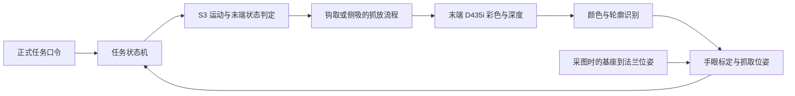

# 硬件与传统视觉方案

更新日期：2026-09-06。状态：方案草案，尚无采集、标定、驱动联通或实机测试结果。

本文区分用户确认、官方资料和工程建议。比赛事实沿用 [资料说明](../materials/README.md) 中的 RULES、FAQ、MAP 标识及 PDF 页码；新增来源同步登记在 [manifest.json](../materials/manifest.json)。

## 已确认配置与边界

| 项目 | 当前结论 | 来源 / 未确认部分 |
| --- | --- | --- |
| 机械臂 | 遨博 S3 | 用户 2026-09-06 会话，USER-HW-20260906；实机代次、控制柜、软件及 SDK 待核对 |
| 相机 | RealSense D435i，计划末端安装（eye-in-hand，眼在手上） | 型号来自 USER-HW-20260906；安装方式由 USER-HW-20260906-03 确认，具体支架、固件和连接环境待确定，安装完成状态未核实 |
| 技术路线 | 传统视觉 | 同上；具体算法和控制架构为下文工程建议 |
| 末端执行方式 | 方案一：钩取提手；方案二：吸盘侧面吸附；方案三：卡环 | 分别来自 USER-EE-20260906-01、USER-EE-20260906-02、USER-EE-20260906-04；三方案并列评估，具体工具与最终选用方案待实物验证 |
| 计算平台 | 实机部署在 NUC：原生 Ubuntu 22.04 + ROS 2 Humble | 用户确认 USER-HW-20260923-02、USER-HW-20260923-03、USER-HW-20260923-04（早先 USER-HW-20260906-02 的「本机」指当前开发电脑，USER-HW-20260923-05 澄清；部署已改为 NUC）；NUC 型号、USB 3 与网口、是否到位未说明。当时终端观测的 Ubuntu 22.04.5 LTS / WSL2 x86_64（ENV-LOCAL-20260906）是开发环境，不代表部署环境 |
| 道具几何资料 | 带提手圆角盒体；名义底面 70×80、本体高 50、提手高出 30 | 用户提供 BATTERY-RENDER、BATTERY-DRAWING；单位暂按 mm 解释，设计图不等于实测，详见 [几何与抓取分析](battery-geometry.md) |
| 实施范围 | 暂按初赛固定工位设计 | 工程假设；初赛底座不可移动（RULES p2；FAQ p1–2），是否兼顾决赛仍见 Q01 |

遨博 2023-12-07 的官方发布前介绍明确列出 S3（3 kg）并说明 S 系列搭载 ARCS（AUBO-S3）。这可以作为型号与控制系统的历史参考；用户实机的额定参数、软件版本及适用接口仍须按铭牌和配套手册核对，不套用 i3、iS3 或其他 S 系列机型参数。

用户先确认相机计划末端安装（USER-HW-20260906-03），后选择钩子（USER-EE-20260906-01），又新增方案二吸盘侧吸（USER-EE-20260906-02）和方案三卡环（USER-EE-20260906-04）。三种工具共用传统视觉与任务判定框架。相机保持眼在手上的方式，建议固定在法兰转接件或工具固定座。此前“没有夹爪”保留为历史设备状态；具体末端硬件是否已有仍待核对。

## 末端设计与推进顺序

先在本机准备图像采集与离线颜色识别，同时核对实物、S3 法兰与三种末端方案。每套工具分别标定 TCP：钩具记录承托参考点及钩尖偏移；吸盘记录接触中心、法向及工作压缩量造成的偏移；卡环记录卡持参考面、环轴线及锁止位置。相机支架固定后完成手眼标定；更换工具后重标工具 TCP，相机相对法兰的安装关系改变时重做手眼标定。实机验证以所选工具和电池到位为条件。

尺寸图给出提手下方名义净高 20、横梁前后厚度 26、竖向高度 10，开口宽约 50 依赖立柱对称推算（BATTERY-DRAWING，暂按 mm）。建议先评估固定被动钩从前/后方水平穿孔、上抬托住横梁，再通过落台卸载、下降清出钩尖、水平退钩完成释放。穿孔部分的完整包络须小于实际开口并留余量，不能只检查杆件厚度；具体可逆条件、材料与承载待验证，详见 [钩取几何与流程](battery-geometry.md)。

侧吸方案拟接触本体的 70×50 或 80×50 竖直侧面，数值是图示外包络，实际可密封面须扣除圆角等不可用区域（BATTERY-DRAWING，单位暂按 mm）。需配置与实物匹配的吸盘、支架、真空源、吸附/泄压阀、管路和真空反馈；不假定 S3 已有供气或兼容的电气接口。先验证气密性、切向抗滑、偏心力矩及落台泄压后的撤离，再接入机械臂。结构与受力示例、两方案取舍依据见 [末端两方案与侧吸设计](end-effector-options.md)。

卡环方案拟用环形件套入或卡住提手横梁/本体指定部位；卡持对象、环内尺寸、开口或闭合方式、锁止和释放动作均未确定。先以实体样件验证套入扫掠、承载、防脱、对电池干涉和落台脱离，再确定是否需要电动开合。该方案的几何与接触物理不纳入当前仿真接触范围。

当前终端环境来自只读系统检查，仅代表本次工作区运行环境，不等于已确认的最终设备控制环境。后续应先验证 D435i 在所选运行环境中可枚举和采集，再固定依赖版本；尚未进行相机采流或机器人连接。

2026-09-06 本机只读盘点（ENV-LOCAL-20260906）：`/usr/bin/python3` 为 Python 3.10.12，当前解释器的包元数据可见 NumPy 2.2.6、opencv-python 4.13.0.92，未找到 opencv-contrib-python 和 pyrealsense2。`lsusb` 无设备输出且退出码为 1，因此此次检查未能枚举相机；这不证明 Windows 主机未连接相机。该检查未导入视觉/设备库，包元数据存在也不等于已通过运行验证。

## 建议架构

按已确认的末端安装，建议采用“末端相机到观察位停稳采图 + 颜色分割 + 深度与手眼标定定位 + 状态机抓放 + 放后复核”。相机随机械臂运动，每次采图都要关联当时的末端位姿。

这一路线的适用性是工程判断：初赛目标颜色可区分、工作台固定，适合先用可解释的颜色与几何处理验证闭环（任务依据：RULES p2–3；FAQ p1）。初版在动作前后重新观察，不等同于运动过程中连续更新速度的视觉伺服；实际申报类别需结合组委会口径确认（FAQ p3，Q10）。

### 1. 相机布置与采集

- 建议把 D435i 刚性固定到法兰转接件或工具固定座，保持相机相对法兰的位姿恒定。支架设计需核验钩具进退或吸盘侧向接近路径、视线遮挡以及线缆/真空管走向；不把相机固定到吸盘的柔性或活动部分。
- 设置初始区观察位和放置区复核位；机械臂到位停稳后采集新帧，记录对应法兰位姿，避免使用移动前缓存的图像。若单一观察位无法覆盖所需区域，可分区观察并统一转换到基座坐标系。
- 官方 D435i 页面列出彩色视场约 69°×42°、深度视场约 87°×58°，最大分辨率下最小深度距离约 28 cm。布置须按彩色与深度的共同有效视野核验，不能仅凭深度视场估算覆盖。（RS-D435I）
- 观察距离根据当前要覆盖的区域、深度有效范围、支架偏移及 S3 可达姿态确定。若尝试正俯视单帧覆盖整张 700×540 mm 底图（MAP p1–2，PDF 页面尺寸），按上述彩色视场估算的桌面距离下界约为 0.70 m；该条件推算不代表 S3 能到达该观察姿态，也不是本方案必须采用的距离。可改用分区观察，实际仍需给电池高度、画面边缘和安装误差留余量。
- 观察位与最终抓取位分别验证。下探时若目标进入深度近距无效区，使用已在有效观察位确认的基座坐标完成经过验证的接近动作，不使用无效深度继续修正位姿；需要再定位时先回到有效观察距离。
- 用实物调好补光、曝光和白平衡，参数稳定后保存。采集彩色、深度、时间戳、实际流模式、内参、深度单位及对应法兰位姿；初版用停稳采图，不依赖 IMU 提供末端定位。

### 2. 颜色与形状识别

- 建议以 OpenCV HSV 阈值分割起步，阈值由实物样本确定；红色需考虑色相环绕。使用 ROI、形态学处理、连通域/轮廓及实测尺寸筛选候选，排除底图文字、色块、反光和阴影。（方法参考：CV-HSV、CV-SHAPE）
- 输出颜色、轮廓、像素中心、可观测方向与质量标记。接近圆形或对称的轮廓不能强行给出可信朝向；进钩或侧吸方向须结合物体姿态与周围通道决定。
- 用主体圆角外轮廓与提手横梁方向共同估计朝向，沿前后方向选择有空间的孔口侧进钩；必要时增加斜视观察位确认孔口（BATTERY-DRAWING，工程设计）。渲染图的黄色不用于设置实物颜色阈值。
- 侧吸时在主体上选择可接近的侧面，输出接触点、侧面法向及密封区域质量。增加可见该面的斜视观察位，或由经实物核验的几何模型推算；正俯视图不能直接证明竖直侧面平整气密，密封能力须通过实物试验确认。
- 连续多帧确认后再选择目标；颜色歧义、遮挡严重、多个候选无法区分时重新观察。抓错颜色有扣分，因此不能仅凭初始位置代替颜色判断。（RULES p4；FAQ p5）

### 3. 定位、标定与误差

- 标定相机到法兰的固定变换 `T_flange_camera`。建议将标定板固定在工作台上，采集多组不同末端位置与朝向的图像/机器人位姿；用标定板到相机、法兰到基座的成对位姿求手眼外参。OpenCV `calibrateHandEye` 的 `gripper2base` 输入在此使用法兰坐标，输出 `cam2gripper` 对应相机到法兰；必须核对变换方向，采样应包含绕不平行轴的转动。（CV-CALIB）
- 用未参与拟合的观察姿态和测量点验证：同一固定目标经不同末端观察位变换后应得到一致的基座位置，并与独立实测坐标比较。另行标定桌面坐标及每套工具 TCP/几何偏移，不能只凭图像重投影误差认定抓取定位合格。
- 深度先与彩色建立对应关系，使用当前帧匹配的内参、畸变模型和深度单位反投影，再变换到基座坐标。不要直接用彩色像素索引未对齐深度，也不要混用两路内参。（RS-ALIGN、RS-PROJECTION）
- 在目标表面内部取有效深度，排除零值、边缘混合像素和离群点；可由有效点拟合表面或作稳健统计。结合已核验的物体模型与工具包络求进钩/承托或侧吸接触位姿，表面点不自动等于工具目标点。
- 按新尺寸图的毫米解释，本体顶面和横梁顶面分别高于底面 50 和 80，横梁下沿由 80−10 推算为 70。应分开提取两层可见表面的深度，以实测开口和钩尖包络求穿孔高度；未直接看到的横梁下沿须标注为模型推算，不能将整个同色区域的单一中值当作进钩高度（BATTERY-DRAWING）。
- 侧吸使用本体竖直侧面的法向和接触高度，不套用横梁的 70/80 高度；平面拟合须有足够的有效侧面点，并排除圆角和边界混合深度。吸盘压缩、滑移会改变物体相对工具的位姿，须在台架和实机试验中标定与复核。
- 桌面单应性可定位底图上的目标区，但相机移动后不能继续套用旧观察位的单应性，也不能把有高度的电池顶面像素当成桌面点。深度质量不足时，只在实测高度、摆放姿态已知且通过验证的条件下，用当前位姿的视线与物体平面求交；条件不满足则重新观察。
- 本方案使用齐次点变换 `p_base = T_base_flange(t) * T_flange_camera * p_camera`，约定 `T_A_B` 将 B 系坐标转换到 A 系；`camera` 必须与反投影使用的相机光学坐标系一致。机器人位姿与图像应按已核对的时钟关系配对，初版在停稳后取新帧与稳定的位姿反馈；不能把不同设备的原始时间戳直接视为同一时钟。统一内部长度与角度单位，由适配层转换到实机接口约定。
- 放置精度由视觉定位、外参、TCP、机械臂定位及工具相关误差共同决定。钩具需考虑挠度、摆动和脱钩拖动；侧吸需考虑压缩、滑移、倾斜和释放残余吸力。两方案均在落台、工具完全脱离后重新观察实际电池足迹，不能只根据末端位置或朝向判定入框。

新尺寸图已给出主体俯视外包络 70×80 和本体圆角 R8（BATTERY-DRAWING，暂按 mm 解释），与底图电池 7×8 cm 注记对应；内圈仍按 MAP p2 的圆形示意和 8×8 cm 注记建模。以直立圆角盒体投影、直径 80 mm 内框计算，居中覆盖率约 85.93%，高于下述 70% 门槛。该值是理想几何推算，尺寸图单位、实物姿态及有效边界仍需核验；轴向偏移计算和使用限制见 [几何分析](battery-geometry.md)。

用户已确认此前“垂直投影70%”的含义、适用于内框，并说明来自组委会答复（USER-RULE-20260906-02，用户转述）。项目据此采用内框判定 `r_inner = Area(B ∩ I) / Area(B) ≥ 0.70`：`B` 为电池主体在底图平面上的完整垂直投影，`I` 为对应内框区域，分母为电池主体总投影面积。来源是用户转述的组委会答复，原答复载体尚未归档；与 RULES p4“完整位于内框内”的历史差异保留在 Q15。70% 适用范围已确认，方案按此推进。

工程上先把电池几何和内框放到同一桌面坐标系，再计算投影交集；末端相机的透视图像中，可见色块像素占比不自动等于主体垂直投影面积占比。对遮挡、反光造成的不完整轮廓，结合实测物体几何恢复足迹或重新观察，不能直接用残缺色块缩小分母。摆放位姿与定位容差按 70% 覆盖条件计算，并同时满足外框的完整入框条件。

放后复核分别记录内框投影覆盖率、外框完整包含结果、颜色、位次和释放稳定性。内框采用 `r_inner ≥ 0.70`，外框仍按主体完整位于框内（RULES p4），T0 仍按主体位于 T0 内及稳定释放（RULES p3）；内框的 70% 阈值不扩展到后两项。工程目标应给覆盖率留出测量误差和释放滑移余量，具体余量根据实测误差确定。

### 4. 抓放与任务执行

三方案采用相同的任务口令、观察和释放复核，抓取与释放阶段按工具分别执行；下表为工程建议，尚未实现控制程序。

| 阶段 | 建议动作与完成条件 |
| --- | --- |
| 准备 | 读取当轮颜色/序列口令，核验标定、工作空间、机器人状态与工具固定情况；侧吸另检查真空源、阀及反馈。正式顺序不得写死为文档示例（RULES p3；FAQ p5） |
| 观察 | 末端相机到达有效观察位，停稳采集并配对法兰位姿；把目标转换到基座坐标后确认有效性 |
| 接近与接合 | 方案一：到孔口外预备位，在满足完整钩尖包络的高度水平穿入，确认越梁且不撞本体。方案二：到所选侧面外预备位，沿法向以经验证的小压缩量接触，建立真空，达到实测设定的阈值并稳定保持后续步（几何依据：BATTERY-DRAWING；流程详见末端方案） |
| 承载与试提 | 方案一：上抬承托横梁再试提。方案二：真空确认后小幅试提并持续监测。方案三：确认卡环套入/锁止后小幅试提。三方案均以视觉确认电池离台、随工具运动且无明显滑移，状态不明不继续搬运；不能仅凭卡环状态或真空读数认定带起电池。基础任务包含离台稳定 2 秒（RULES p3–4） |
| 搬运与落台 | 基础任务放入 T0；序列任务按口令依次放入 P1–P3。根据实测摆动或吸附承载约束限制运动，检查工具、电池及已放电池空间；目标位须预留所选工具的撤离通道（RULES p3；工程路径建议） |
| 卸载与释放 | 方案一：落台后下降卸载，确认钩尖低于横梁下沿且舌底不撞本体，再水平退钩。方案二：落台承重后切断抽气并受控泄压，确认残余吸力释放，再沿侧面法向撤离，避免拖动或带倒电池 |
| 释放复核 | 工具完全脱离后退至复核位，停稳采图并更新位姿变换；观察至少 3 秒，分别核验颜色、目标位、稳定性和对应区域条件。序列内框按电池主体垂直投影覆盖率 ≥70%，外框按完整入框；基础任务按 T0 原文条件。序列任务随后更新场景再取下一块（RULES p3–4；内框口径：USER-RULE-20260906-02） |
| 异常 | 相机数据过期、控制器报错、目标丢失、真空不足或抓取状态不明时不续接下一搬运段，按已验证的停止/就近落台策略处置并记录原因；不得在悬空时主动泄压。重新观察与重试次数应有上限 |

末端负载应计入 D435i、相机支架、所选工具、转接件、末端附加真空组件、线缆/管路及电池，并核对重心和力矩约束。电池单块 200–250 g 来自 FAQ p5；该重量不足以证明钩具/提手强度或吸盘侧向动态承载可用。工作空间检查须包含 TCP 姿态、关节限制、工具完整包络、物体摆动/变形范围及线缆与管路余量。

### 5. 软件组织与验证顺序

建议先用 Python + OpenCV + RealSense SDK 2.0 做视觉原型，依赖版本待电脑系统及相机固件确认后固定。S3 通过独立运动适配层接入，实际 SDK、通信方式和调用约定以该台控制器资料为准；2026-09-23 用户确定实机使用 ROS（USER-HW-20260923），发行版为 ROS 2 Humble（USER-HW-20260923-02），与仿真一致；运动适配层、相机接入与状态监控据此按 ROS 2 节点组织。运行环境为 NUC 上的原生 Ubuntu 22.04（USER-HW-20260923-03、USER-HW-20260923-04）。S3 的 ROS 2 驱动或 SDK 封装、相机 ROS 2 驱动以及是否用 MoveIt 仍未确认（Q17）；发行版一致不代表仿真代码已在实机验证。固定被动钩候选以运动阶段及视觉判定组织状态机；侧吸分支另抽象“建立真空、读取真空状态、泄压、确认释放”操作及超时，不提前指定 IO 引脚、电压或通信协议。主动止退机构仅在后续实际选用时增加驱动。

厂商 ARCS SDK 文档提供 RPC 运动调用及 RTDE 状态订阅等能力（AUBO-SDK），可作为两方案的运动控制候选接口。该文档不证明用户控制器已经支持某个 SDK 版本或真空设备接口；固定被动钩候选本身无需开合通信。

| 顺序 | 可检查的产物 | 验证重点 |
| --- | --- | --- |
| 1 | 设备与实物测量记录、S3 对应手册、两工具台架记录 | 钩取核验孔口、承载和脱钩；侧吸核验可密封面、真空建立/保持、抗滑及力矩和泄压释放；记录各工具 TCP、支架、总负载与接口版本 |
| 2 | 彩色/深度样本、颜色配置和检测叠图 | 停稳采图及位姿配对，四块实物颜色识别，反光/遮挡时的拒识，深度有效率；先离线回放 |
| 3 | 手眼外参、TCP 记录和独立验证误差表 | 多个末端观察姿态下的基座定位一致性与绝对误差，全工作区覆盖、目标高度、坐标轴与单位 |
| 4 | 三方案分别抓放单块到 T0 的连续实验记录 | 分别记录接合、试提、落台、释放成功情况、放置误差、耗时及摆动/滑移/卡环回差/拖动/掉落原因；先验证空载路径再逐步接入实物，依据结果决定最终工具 |
| 5 | 可配置序列任务和放后复核日志 | 按不同测试口令完成三块摆放，分别记录颜色位次、外框完整包含、内框投影覆盖率及 ≥70% 判定、稳定性和耗时 |

测试口令只是调试输入；正式口令由组委会公布（RULES p3；FAQ p5）。每次实验记录软硬件版本、标定版本、口令、时间戳、候选目标及失败原因。重复次数与精度门槛在实物容差明确后制定；目前不声称达到任何成功率或毫米级精度。

## 技术来源与使用说明

以下网页于 2026-09-06 查阅；网页参数不代替实机手册。此轮仅用于方案设计，尚未引入第三方实现代码，也未安装或锁定软件版本。

| 来源标识 | 官方来源 | 本项目用途 |
| --- | --- | --- |
| AUBO-S3 | [遨博 S 系列官方介绍，2023-12-07](https://www.aubo-robotics.cn/news-info/137) | S3 型号、历史负载与 ARCS 系统参考；不是实机验收规格 |
| AUBO-SDK | [AUBO SDK 功能模块](https://developer.aubo-robotics.cn/guide_sdk/2_sdk_function_module.html) | 候选运动控制与状态反馈接口，待实机版本匹配 |
| RS-D435I | [RealSense D435i 产品规格](https://www.realsenseai.com/products/depth-camera-d435i/) | 相机型号、彩色/深度视场及近距条件 |
| RS-ALIGN | [librealsense 深度对齐彩色 Python 示例](https://github.com/realsenseai/librealsense/blob/master/wrappers/python/examples/align-depth2color.py) | 采集、深度单位与对齐流程参考；示例标注 Apache-2.0，尚未复制代码 |
| RS-PROJECTION | [RealSense SDK 2.0 投影文档](https://github.com/realsenseai/librealsense/wiki/Projection-in-RealSense-SDK-2.0) | 内外参、坐标约定、深度反投影与单位 |
| CV-HSV | [OpenCV HSV / inRange 教程](https://docs.opencv.org/4.13.0/da/d97/tutorial_threshold_inRange.html) | 颜色分割方法参考 |
| CV-SHAPE | [OpenCV 轮廓与形状接口](https://docs.opencv.org/4.13.0/d3/dc0/group__imgproc__shape.html) | 轮廓和几何筛选方法参考 |
| CV-CALIB | [OpenCV 标定与三维重建](https://docs.opencv.org/4.13.0/d9/d0c/group__calib3d.html) | 相机标定、坐标几何与 `calibrateHandEye` 的 eye-in-hand 变换约定 |

生成式 AI 使用记录：2026-09-06 使用 OpenAI Codex 协助核对公开资料、整理本方案和同步项目文档；硬件信息来自用户与所列官方资料，工程建议尚待实物验证。后续实际引用代码时，记录仓库、版本/提交、许可证和修改范围。比赛允许相关工具但须说明和标注（FAQ p6，Q17）。

侧吸受力与真空控制的厂商技术来源另见 [末端两方案与侧吸设计](end-effector-options.md)，同样登记于来源清单；未将网页中的通用选型值视为本项目实测参数。
