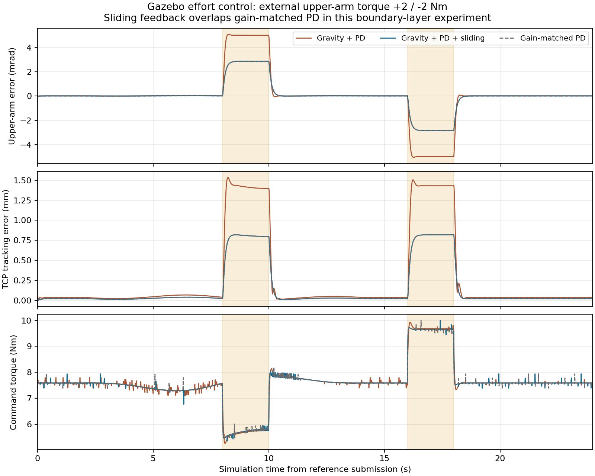

# 力矩闭环：重力补偿与边界层滑模反馈

2026-09-08 新增仿真实验，来源标识 `ROBUST-CONTROL-20260908`。实机控制柜是否开放力矩接口尚未确认，本实现只连接 Gazebo。

## 实际实现

新增 `meituan_robust_control/GravitySlidingController`，继承本机 ROS 2 Humble 的 `JointTrajectoryController`（已安装版本 2.53.3），保留轨迹插值、动作接口和状态发布。独立模式将 Gazebo 的关节命令改为 effort，控制循环 1000 Hz；原 position 模式仍为默认。官方 JTC 文档说明，effort 接口可将位置/速度误差经 PID 转为力矩；这里在其力矩输出后加入重力与鲁棒项。[ROS 2 Control 文档](https://control.ros.org/humble/doc/ros2_controllers/joint_trajectory_controller/doc/parameters.html)

设误差 e=q_d−q，速度误差 ė=q̇_d−q̇，逐关节计算：

```
s = e_dot + lambda * e
tau = clip(g_hat(q) + Kp*e + Kd*e_dot + rho*sat(s/phi), -tau_limit, tau_limit)
sat(x) = clip(x, -1, 1)
```

所有积分增益为 0。`g_hat` 通过 KDL 各有质量连杆的质心雅可比求和，覆盖相机和钩具固定分支；没有把被钩起的电池自动加入名义动力学。力矩限幅来自当前 S3 模型：49/49/39/9.8/9.8/9.8 Nm，不是实机驱动参数确认。

`rho` 为 4/4/3/0.3/0.15/0.05 Nm，`lambda` 均为 6 s⁻¹，`phi` 为 0.08/0.08/0.08/0.12/0.12/0.15 rad/s。鲁棒参数在配置后冻结；启动阶段机器人临时关闭重力时也关闭补偿，逐连杆恢复并核验重力后，通过参数服务开启补偿，避免启动时施加不匹配的重力前馈。

该工程实现采用滑模面与饱和边界层思想，参考 Slotine 的机器人鲁棒控制论文；边界层用于缓和不连续切换及其抖振风险。并未直接复现论文完整控制律，也未验证论文所需的不确定性界。[Slotine, 1985, *The Robust Control of Robot Manipulators*, DOI: 10.1177/027836498500400205，PDF pp.2–4](https://people.csail.mit.edu/rplatt/papers/slotine1985.pdf)

## 对照的含义

- `pd`：重力补偿＋基础 PD。
- `smc`：同一基础 PD＋重力补偿＋上述边界层滑模项。
- `pd_matched`：不加滑模项，但 Kp 增加 rho*lambda/phi、Kd 增加 rho/phi。

当 |s|≤phi 时，smc 与 pd_matched 在代数上等价。仅证明 smc 比基础 pd 的误差小，不能据此声称优于增益匹配 PD，更不能直接声称有非线性鲁棒性优势。

## 验证设计

先完成 PD 静止验证和一组 2 Nm 开发对照。随后冻结 [协议与代码/二进制哈希](experiments/robust-control-20260908/protocol.json)，执行 0/2/3 Nm × 三种模式，共 9 次，不按结果调参或删除失败。

参考为起始高位附近的小幅平滑关节运动，时长 24 s；2–14 s 运动，其余保持。参考位置、速度、加速度在运动边界连续。所有模式使用相同参考；Gazebo 力服务在 upperArm_joint 施加 +幅值（8–10 s）和 −幅值（16–18 s），控制器不知道扰动时刻或幅值，只接收状态反馈。[Gazebo 力服务接口](https://docs.ros.org/en/rolling/p/gazebo_ros/generated/classgazebo__ros_1_1GazeboRosForceSystem.html)

冻结版按约 100 Hz 的控制审计数据计算 TCP 跟踪误差与分时窗指标，额外记录名义重力、鲁棒项、未限幅/已限幅力矩和滑模面。初始开发对照使用较低频的旧状态话题，不能直接混作同一统计样本。最大值均是采样最大值，不是 1 kHz 全周期峰值。扰动通过服务成功应答确认，未另装外力传感器测量。

高位探针不抓取电池，不能用来证明不会掉落。恢复窗（20–24 s）TCP 误差 <10 mm 且电池移动 <2 mm 为完成门限；误差大小另外完整报告，不用“通过”代替性能比较。

## 复现

重新构建包含新插件的工作空间，参见 [SETUP](../demo/SETUP.md)：

```bash
export AUBO_ROS2_WS=/tmp/meituan-release-repro-ws
bash demo/setup-workspace.sh
bash demo/run.sh --control pd --robust-probe --disturbance-nm 2
bash demo/run.sh --control smc --robust-probe --disturbance-nm 2
bash demo/run.sh --control pd_matched --robust-probe --disturbance-nm 2
```

`--control smc` 也可与现有单块入口组合；是否通过抓取必须单独验证，不能由高位结果推出。批量协议含本机二进制绝对路径和哈希，其他机器重新编译后须制作自己的协议副本并记录变化，不应覆写本次归档。

## 结果与限制

固定 9 次对照全部完成并通过，控制源文件和插件二进制哈希在实验前后未变。没有重试替换或删除失败。

| 扰动幅值 | 模式 | 运动扰动窗 TCP RMS | 保持扰动窗 TCP RMS |
| --- | --- | --- | --- |
| 0 Nm | pd | 0.020 mm | 0.036 mm |
| 0 Nm | smc | 0.013 mm | 0.021 mm |
| 0 Nm | pd_matched | 0.013 mm | 0.021 mm |
| 2 Nm | pd_matched | 0.777 mm | 0.785 mm |
| 2 Nm | smc | 0.778 mm | 0.785 mm |
| 2 Nm | pd | 1.391 mm | 1.399 mm |
| 3 Nm | smc | 1.163 mm | 1.182 mm |
| 3 Nm | pd | 2.082 mm | 2.106 mm |
| 3 Nm | pd_matched | 1.165 mm | 1.181 mm |

2/3 Nm 下 smc 相比基础 pd 的扰动窗 RMS 约降低 44%；但 smc 与 pd_matched 几乎重合。这些采样中滑模项未到达 rho 饱和值，主要验证了边界层内的增益效果，没有证明相对增益匹配 PD 的鲁棒优势。

默认 position 模式在更新工作空间后也通过了 7 秒视频 smoke，未切换默认控制器。

九次运行的审计样本均无输出限幅，电池最大位移均为 0。每条件一次，不能据此估计成功率；采样未见限幅不等于证明全部 1 kHz 周期均未限幅。

随后以 `--control smc --vision correct` 执行黄块 → P1，任务通过，落点误差 3.497 mm、覆盖率 83.824%，其他三块未观测到移动。TCP 跟踪 RMS 1.273 mm、采样峰值 2.667 mm。该次搬运没有施加外部试验扰动，也未给力矩模式做三块序列验证；不能用高位结果代替受扰抓取验证，或声称消除了蓝块掉落和释放偏移。

验证包括 14 项 Python 单元测试、直接编译执行的 C++ 滑模反馈符号/奇对称/边界内等价性/幅值界测试，以及 9 次高位物理仿真和 1 次抓取集成。重力补偿用独立 URDF 势能差分复核：初始开发对照 15 个状态最大差异 0.000141 Nm，冻结版 0 Nm smc 复核约 0.001131 Nm（取最近审计时间戳，非严格同步）。



[全部结果与原始文件哈希](experiments/robust-control-20260908/results.json)及逐次 summary、输入、扰动服务应答和控制参数已归档。完整本机视频、轨迹、力矩审计与模型状态在 `outputs/robust-control-20260908/`，未纳入 Git。最初的静止验证和两次低频开发对照也单独保留，不混入固定九次结果。

没有逆动力学惯性/科氏补偿，没有证明不确定性上界足以由 rho 覆盖，也没有考虑限幅下的全局稳定性证明。边界层和输出限幅不等于形式化安全控制；实机可用性、三块掉落原因和约 11 mm 释放偏移仍需各自验证。

实现由 OpenAI Codex 协助；调用 ROS 2 Control、Orocos KDL/kdl_parser 和 Gazebo 官方接口，未复制论文或第三方控制器源代码。源码保留 Apache-2.0 声明及参考来源，便于技术报告披露。
