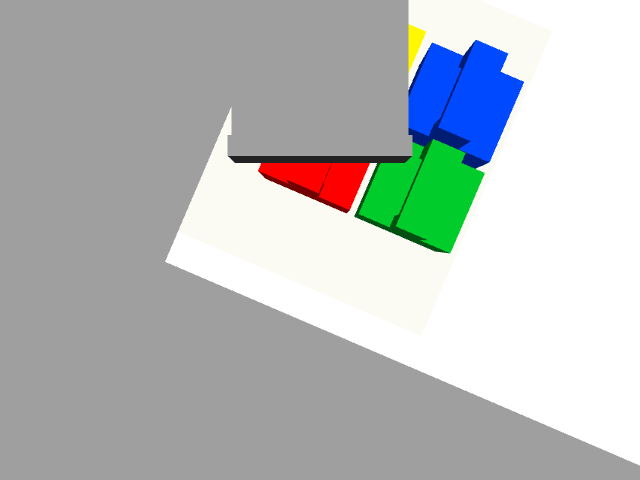
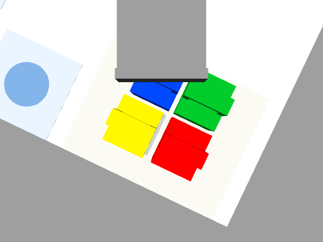

# 黄色单块：RGB-D 抓取前修正

2026-09-07 开始、2026-09-08 整理完成的实验，来源标识 `VISION-CORRECTION-20260907`。这是本机仿真实测，不是比赛成绩或实机验证；黄块 → P1 为示例任务。此前公开 `demo-v1.0.0` 仍是冻结开环轨迹版本。

## 实现与数据边界

腕部相机先到 450 mm 法兰高度的观察位。HSV 分割黄色，再按彩色/深度内参映射像素，用深度时间戳对应的 `base_link` TF 反投影；拟合本体足迹得到中心。两个传感器光心重合是当前仿真假设。拒绝多候选、无有效提手、尺寸异常、深度有效率 <90%、偏航 >3° 或位移修正 >10 mm 的结果。

控制修正只接收识别结果。场景参数只在生成新世界时设置黄色初始 x 偏移；没有运行中传送物体，也不使用 `/gazebo/model_states` 提供抓取中心。模型真值用于观察阶段电池位移审计与抓取后评估。局部 IK 保持原法兰方向，修正源端接近、穿钩、提升，搬运段逐步回到原定 P1，释放段保持不变。执行期间仍是开环轨迹。

观察动作的 101 点近似碰撞检查不等于连续碰撞验证；局部修正路径未重新计算全路径碰撞。`corrected-plan.json` 将原碰撞代价与 IK 残差分别标注，避免把旧值当作新验证。主视频从观察完成后开始，观察快照与原始 RGB-D 单独保存。

## 对照方法

每次启动独立 Gazebo 世界。`observe` 与 `correct` 使用相同观察位和识别门限，前者仅记录测量，后者应用修正。落台与非目标移动判定沿用 `demo/metrics.py`；中心误差是电池落点到 P1 的距离，不是关节跟踪误差。观察动作耗时不包含在约 57 秒主抓取视频中。

| 场景 / 模式 | 结果 | 落点中心误差 | 视觉测得 x/y 修正 |
| --- | --- | --- | --- |
| +6 mm，旧观察位修正尝试 | 黄色被钩具遮挡，抓取前停止 | — | 无候选 |
| +6 mm，调整观察位后修正首轮 | 通过 | 2.027 mm | +7.300 / −0.374 mm |
| +6 mm，仅观察、不应用修正 | 通过 | 2.509 mm | +7.300 / −0.374 mm（未应用） |
| +6 mm，最终代码修正复验 | 通过 | 2.120 mm | +7.301 / −0.375 mm |
| 0 mm，最终代码修正 | 通过 | 2.182 mm | +1.136 / −0.390 mm |

以上是开发过程的全部五次尝试，包含一次观察失败、四次完整抓取；不是预注册重复试验或成功率估计。最终 +6 mm 与 0 mm 的观察阶段电池最大位移均记录为 0，抓取阶段其他三块亦为 0。对照组蓝块最大平移约 0.091 mm、旋转 0.115°，在现有门限内。最终两轮内框覆盖率分别为 84.467% 和 84.448%。

名义布局仍测出约 1.20 mm 二维偏差；+6 mm 布局的二维定位误差约 1.35 mm。可能与像素采样、边缘内缩及可见表面有关，尚未进行误差源分解；不能把图像处理输出视为无偏真值。所有修正值均直接采用测量，没有按已知场景偏移回填。

精简结果、输入哈希和五次尝试索引已归档在 [实验记录目录](experiments/vision-20260907/index.json)。视频与完整原始数据现已发布到 [Vision v1.1.0 Release](https://github.com/AfonsoZhang/meituan-robotics-challenge-2026/releases/tag/vision-v1.1.0)，包含五次尝试与 SHA-256 校验。本机副本保存在 `outputs/vision-20260907/`（未纳入 Git）；最终偏移修正视频为 `vision-correct-6mm-final/demo.mp4`。图像与轨迹可分别用 `demo/replay_vision.py`、`demo/report.py` 离线复核。9 项单元测试通过，涵盖现有放置判定、识别拒绝和局部 IK 源端平移/末端方向/目标不变。

## 失败记录与解释边界

第一轮采用旧 `V1_over_A_450` 观察位，完整钩具遮住黄色电池，没有检出候选；程序在抓取前停止。这是观察方案失败，不能从统计中删除。最终采用旧 `V2_over_D_450` 的等价关节分支，成功观测黄色本体与提手。

+6 mm 对照中的原冻结轨迹也能成功，因此不能声称视觉修正把失败变成成功，或已提高成功率。落点的少量差异不足以推断统计优势。当前证据支持“测量进入规划且完成单块抓取”，仍不足以证明鲁棒控制、在线视觉伺服或三块闭环稳定性。

下一阶段应预先固定位置/偏航扰动矩阵和重复次数，统计识别拒绝、获取失败、掉落、非目标扰动及落点分布；不能事后只挑开环失败而修正成功的条件。三块扩展还需要每次抓取前重新观察、遮挡恢复与失败处理。

## 复现

依赖与搭建见 [SETUP](../demo/SETUP.md)，命令见 [demo README](../demo/README.md)。算法和观察位出处、原文件哈希、Claude Code 与 OpenAI Codex 使用说明见 [vision-provenance.json](../demo/data/vision-provenance.json)。
